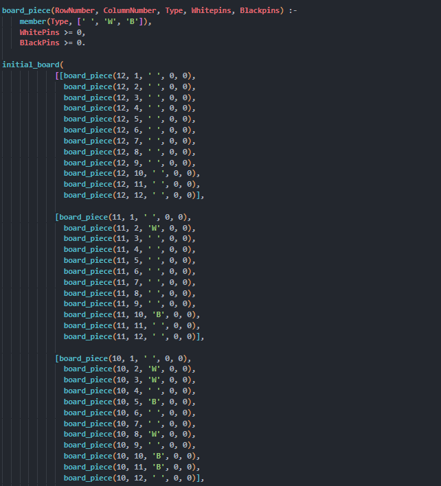
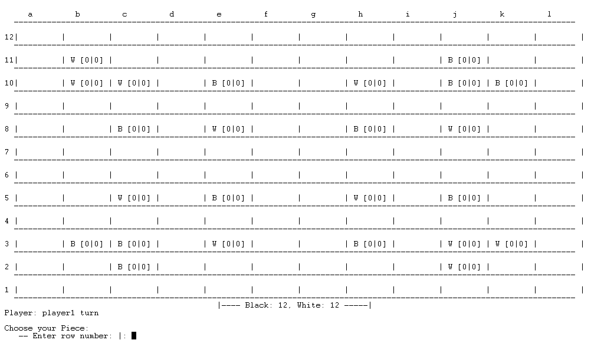
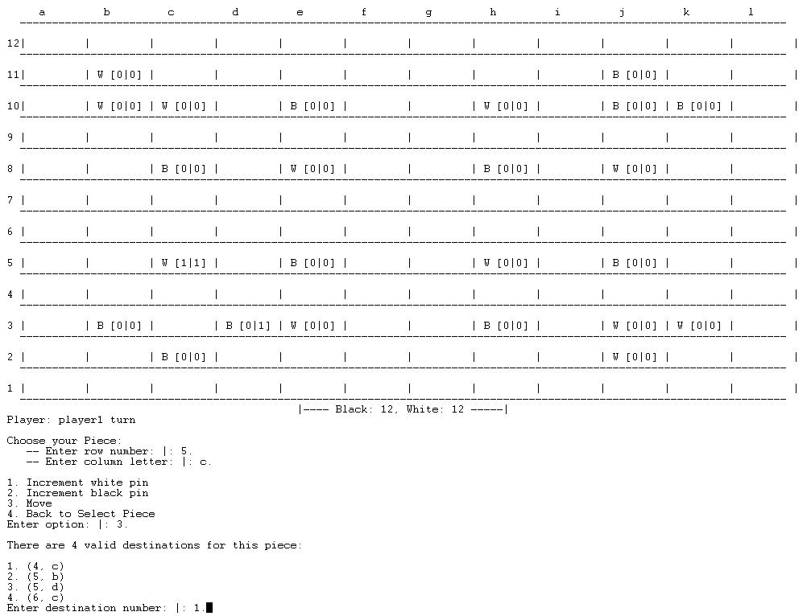
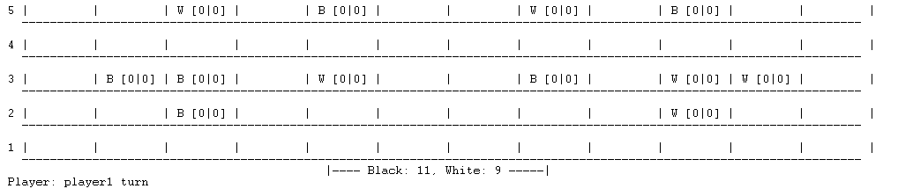
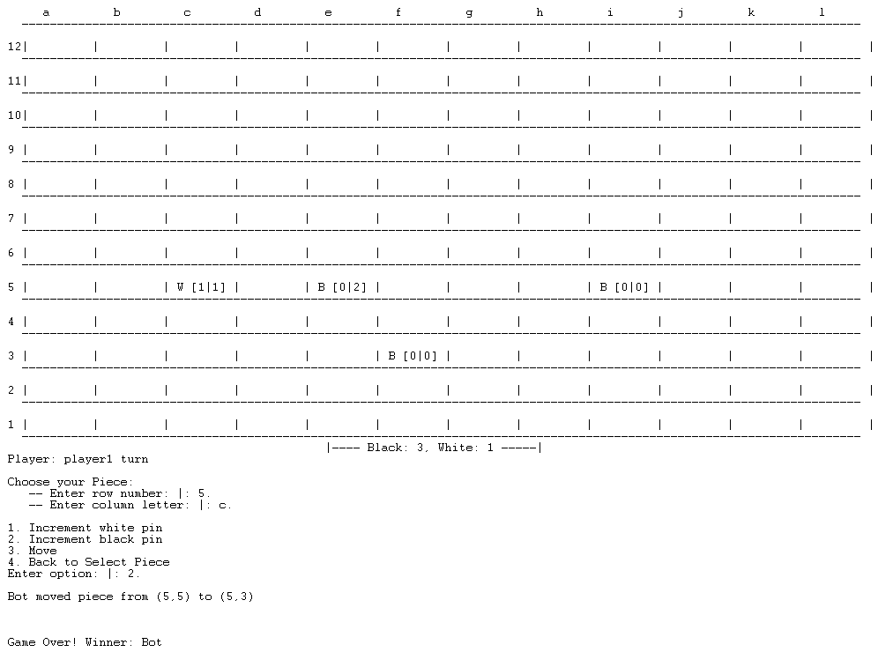
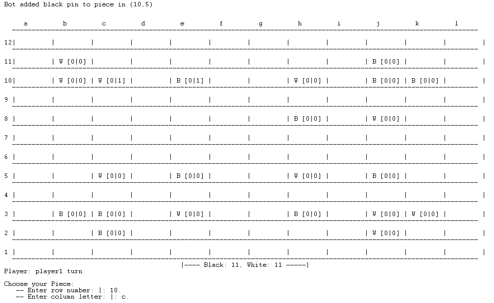
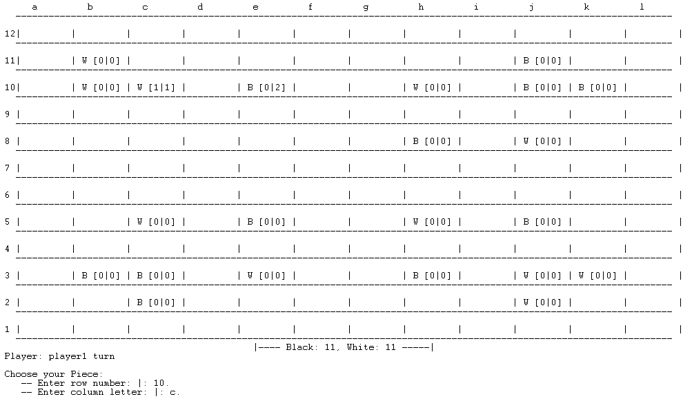
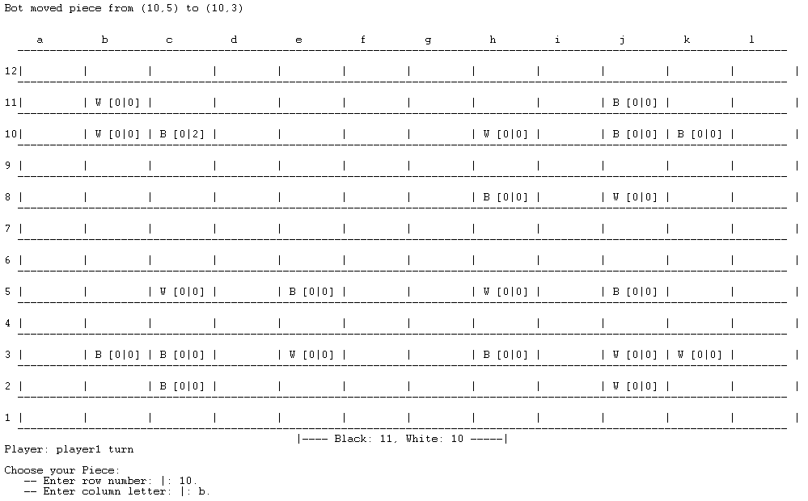
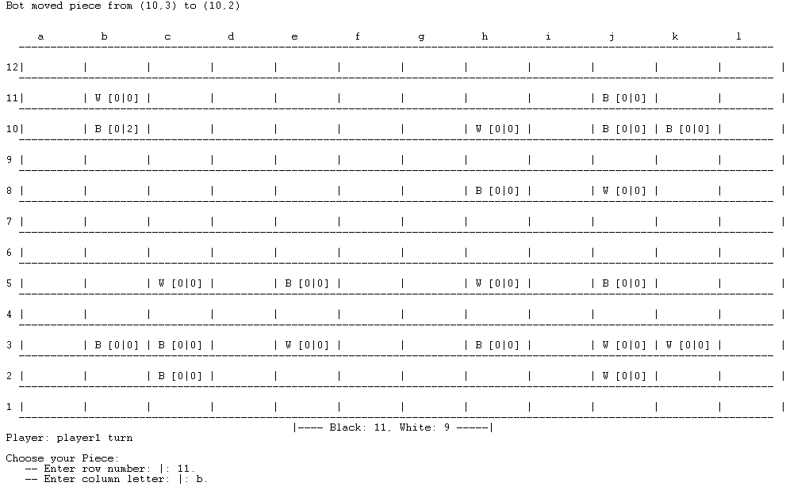

# Stlts

## Project description

Stlts is a strategy game developed using Prolog for FEUP's PFL (Logic and Functional Programming) course.

### Group members

- Afonso Martins [up202005900](mailto:up202005900@edu.fe.up.pt) | Contribution: 50%.
- José Diogo Pinto [up202003529](mailto:up202003529@edu.fe.up.pt) | Contribution: 50%.

## Installation And Execution

### Requisites

- SICStus Prolog 4.7.1

### Running the game

1. Change directory to the  `/src` folder
2. Open SICStus Prolog
3. Run `consult('main.pl').` to start the game application
4. To start the game, run `play.`

## Game Rules

__Stlts__ is a strategic board game, played on a 12x12 checkerboard with black and white pieces into which pins are placed. The objective of the game is to take all the opponent's pieces.

Players take turns, with white pieces beggining.

On each turn a player may either

- insert a pin of either color in one of their pieces
- move one of their pieces

A piece may move to any square that can be reached by a sequence of one-square horizontal and vertical moves where the maximum number of vertical moves is the number of white pins in the piece and the maximum number of horizontal moves is the number of black pins (a piece with no pins cannot move). A piece may not move through a square occupied by another piece of either color. To take an opponent's piece a player moves to that square and it is removed.

More information [here](https://boardgamegeek.com/boardgame/16237/stlts).

## How to play

In this digital version of the game, there the following game modes:

- Player x Player - Players take turns to try and beat each other.
- Player x Bot - The player faces a bot that can play the game by choosing random moves (difficulty level 1) or the best move at the moment, using a greedy algorithm (difficulty level 2).

## Game logic

### Internal representation of the state of the game

To represent the game data in Prolog, we used the following model:

| Game Element   | Representation |
| -----------    | -----------    |
| Piece          |board_piece(+RowNum, +ColumnNum, +Type, +WhitePinCount, +BlackPinCount) |
| Board | The board is represented in initial_board, which is a list of lists, being that  each internal List represents one row of the board, as can be seen in the Image bellow. When the game is initialized, the contents of initial_board are copied to current_board, where the updates occur as the game develops, this also makes it easier to reset the board if needed (using the built-in predicates __retract__ and __asserta__).   |

  

### Game state view

The game state is displayed using the following predicates:

```pl
% display_game(+GameState-Player)
display_game(GameState-Player) :-
    % fetch the initial board state
    current_board(Board),
    nl, nl, 
    format('~t~1|~t~a~t~10+~t~a~t~10+~t~a~t~10+~t~a~t~10+~t~a~t~10+~t~a~t~10+~t~a~t~10+~t~a~t~10+~t~a~t~10+~t~a~t~10+~t~a~t~10+~t~a~t~10+~n', ['a','b','c','d','e','f','g','h','i','j','k','l']),
    format('~t~2|~`-t~9+~`-t~9+~`-t~9+~`-t~9+~`-t~9+~`-t~10+~`-t~10+~`-t~10+~`-t~10+~`-t~10+~`-t~10+~`-t~9+~`-t~5+~n', []),
    maplist(display_row, Board, [12,11,10,9,8,7,6,5,4,3,2,1]),
    count_board_pieces(Board, 0, 0, BCount, WCount),
    format('                                             |---- Black: ~d, White: ~d -----|\n', [BCount, WCount]),
    format('Player: ~w turn\n', [Player]).

display_row(Row, RowNum) :-
    nl,
    format('~d~t~2||', [RowNum]),
    (foreach(BoardPiece, Row), count(ColumnNum, 1, _Max) do
        arg(3, BoardPiece, Type),
        arg(4, BoardPiece, WhitePins),
        arg(5, BoardPiece, BlackPins),
        draw_board_piece(Type, WhitePins, BlackPins)
    ),
    nl,
    format('~t~2|~`-t~9+~`-t~9+~`-t~9+~`-t~9+~`-t~9+~`-t~10+~`-t~10+~`-t~10+~`-t~10+~`-t~10+~`-t~10+~`-t~9+~`-t~5+~n', []).


% draw_board_piece(+Type, +WhitePins, +BlackPins)
draw_board_piece(Type, WhitePins, BlackPins) :-
    (Type = ' ' -> write('         |'); format(' ~w [~w|~w] |', [Type, WhitePins, BlackPins])).
```

And the display initially looks something like this:

  

### Moves Execution

Each turn, a player is asked to choose the row and column of the piece they wish to move. Then, 3 options are available:

- Increment white pin
- Increment black pin
- Move piece

 The first two options are self-explainatory: in each of them, the corresponding predicates - `increment_white_pin(RowNum, ColumnNum)` and `increment_black_pin(RowNum, ColumnNum)` - are called with the row and column of the current piece, updating the number of pins in its interrnal representation.

The third option is a bit more complex. having the row and column of the chosen piece, a list of available moves is displayed, from which the player must choose one. To get this list, we use the predicate `valid_moves(+FromRowNum, +FromColumnNum, -MoveDestinations)`, which is described in more detail in the next section. Then, the predicate `move(+FromRowNum, +FromColumnNum, +ToRowNum, +ToColumnNum)` is called, and the coordinates of the piece are updated. This way, we can make sure that the player only chooses a vald move, and if there are none, the only option is to increment the pins in the piece.



In this image, the player chose the piece in 5.c., the option to move it with 3. and finally the move destination (4,c) with 1. - having a white and black pin, the moves could be of 1 unit horizontally or vertically - the options presented.

### List of Valid Moves

During the development of the game, it proved necessary to have some kind of way of letting the player know the possible moves based on the chosen piece. This was also useful for analyzing the possible plays for the bot. To implement this, we chose to ask the player for the coordinates on the board of the desired piece, and then present the options for adding pins, or moving the piece. If there are moves available for that piece, the player can choose one from the list, if not, the only option is to place a new pin.

To do this, we use the following predicates:

| Predicate   | Description |
| ----------- | ----------- |
| `validate_move(+FromRowNum, +FromColumnNum, +ToRowNum, +ToColumnNum)`    |  Checks if a move is valid, based on the rules of the game described above. This is done based on other predicates, such as `check_col_range(+StartColumn, +EndColumn, +Row)`, `check_row_range(+StartRow, +EndRow, +Column)`, `check_same_type(+FromRowNum, +FromColumnNum, +ToRowNum, +ToColumnNum)`, `has_enough_pins(+FromRowNum, +FromColumnNum, +ToRowNum, +ToColumnNum)`        |
| `valid_moves(+FromRowNum, +FromColumnNum, -MoveDestinations)`          |   Returns __MoveDestinations__, which lists all possible moves based on the initial row and column of a piece.        |

With __MoveDestinations__, we can then evaluate the possible moves for the player, and best or random moves for the bot.

### End of Game / Board Evaluation

The game ends when one of the players has no more pieces on the board. The player with the most pieces wins.

The predicate used to check for the end of the game is `game_over(-Winner, +Mode)`. This predicate counts the remainig pieces of each colour in the board using `count_board_pieces(+Board, +BCount, +WCount, -BCountOut, -WCountOut)`, which evaluates the board, returning the respective count in BCountOut and WCountOut. Based on this and on the mode (PvP pr PvE), the winner will be "Player1", "Player2" or "Bot".

  

Piece count after evaluating the board



Game over situation

### Computer move

The bot can play in two different difficulty levels:

- Level 1: Random moves - "easy" mode
- Level 2: Greedy algorithm - "hard" mode

For both difficulty levels, there is a speceific game loop which calls a function that allows the bot to make a choice.

#### Easy bot

The predicate which allows this bot to make a choice is called `manage_piece_bot_easy(-Piece)`. It uses a variety of other predicates, which are described in order below.

- `select_random_black_piece(-RowNum, -ColNum)` - selects the coordinates of a random black piece and returns in RowNum, ColNum.

- `valid_moves(+FromRowNum, +FromColumnNum, -MoveDestinations)` - checks if there are valid moves (described earlier)

- If there are valid moves, select a random one with `get_random_destination(+MoveDestinations, -TR, -TC)`

- If there are no valid moves, select a random pin color to increment and use on of the predicates: `increment_white_pin(RowNum, ColumnNum)` or `increment_black_pin(RowNum, ColumnNum)`.

- The predicate `random` is used to generate a random number everytime we want to make a random choice.

### Hard bot

The predicate which allows this bot to make a choice is called `manage_piece_bot_hard(-Piece)`. It uses a variety of other predicates, which are described in order below.

- `closest_black_piece(-BlackRow, -BlackColumn, -WhiteRow, -WhiteCol)` - selects the coordinates of the black piece that is closest to a white piece and returns the coordinates of the two pieces that are close to each other in BlackRow, BlackColumn, WhiteRow, WhiteCol

- `get_board_piece(+RowNum, +ColNum, -Piece)` - gets the closest black piece representation (with pins, etc.) in the board at the given coordinates

- `Vdis is abs(BlackRow-WhiteRow), Hdis is abs(BlackColumn-WhiteCol)` - calculates the vertical and horizontal distances between the two pieces, to be used later in calculations and best move choice

- `valid_moves(+FromRowNum, +FromColumnNum, -MoveDestinations)` - checks if there are valid moves (described earlier)

- After all these predicates, we have a big logic block that chceks first if the pieces are in the same row/different column, same column/different row or different row and column. For each case, if the bot can move and capture the other piece, it will do that, if not, it will increment the black pin if they are in the same row or the white pin if they are in the same column. For the third case, when both row and column are different, if the calculated horizontal distance is greater than the vertical distance, the white pin will be incremented, otherwise, the black pin will be incremented. This allows the bot to "follow" the movement of the player, and get closer and closer with each play, eventually ending up in a situation where there are enough pins to move and capture the player's piece.

The following images depict the behavior of the bot:





  

  

### Conclusions

Developing a game in Prolog was a highly educational and enriching experience. It allowed us to improve our skills and expand our knowledge in the field of programming. The use of the Prolog/logical programming paradigm offered a unique and interesting approach to game development, introducing us to new ways of thinking about problem-solving and logic. Overall, the project was a valuable and enjoyable learning experience that we would recommend to others interested in exploring different programming paradigms.

### Bibliography

***

- [igGameCenter](https://www.iggamecenter.com/en/rules/stlts)
- [Board Game Geek](https://boardgamegeek.com/boardgame/16237/stlts)
- [YouTube - Mango Town Plays](https://www.youtube.com/watch?v=mEaDUg-L7aE)
- [SicsTus Prolog 4](https://sicstus.sics.se/)
